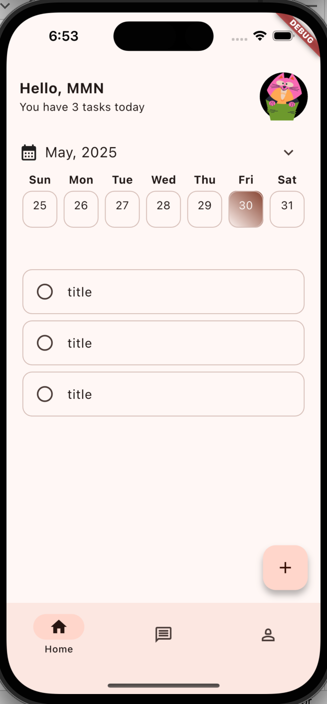
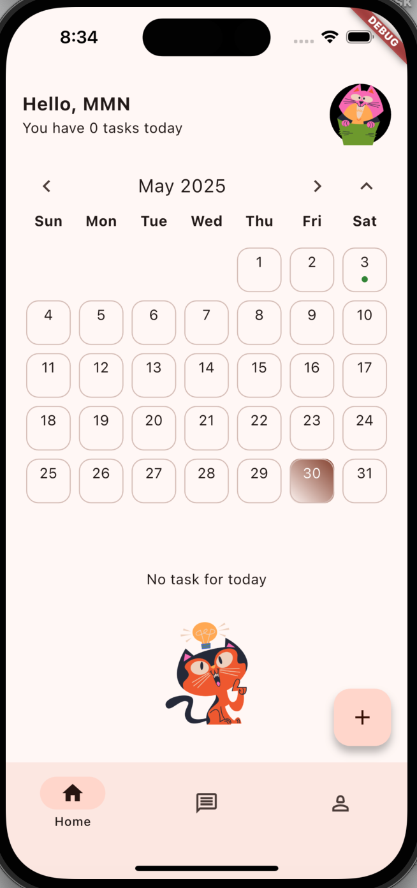
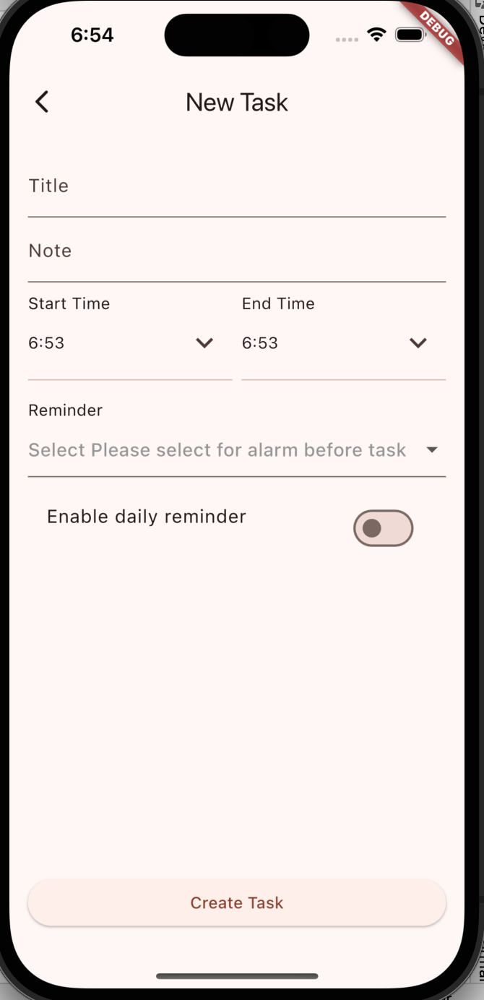

# bit_task

A simple multi-user Todo app built with Flutter, using Supabase as the backend and Riverpod for state management. The app follows the MVVM architectural pattern.

## Features

- ✅ Add Todo
- 📋 View Todo
- 🗃️ Supabase as Datastore
- 🔄 Riverpod as State Management
- 🧱 MVVM Architecture
- 
## Getting Started

You can either run the app locally or download the ready-to-use APK.

###  Try It Instantly

 [Download APK](showcase_apk/BitTaskV1.0.apk)

No setup required — this APK is connected to a demo Supabase backend.You can either run the app locally or download the ready-to-use APK.

### 📋 Home Page

### 📋 Home Page with No Task 

### ➕ Add New Task

